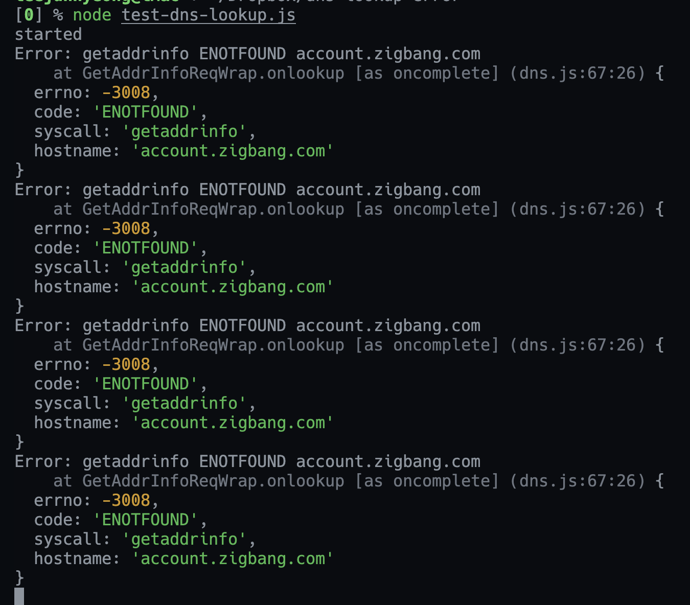

# DNS Lookup 에러 재현

## Getting Started

```sh
node test-dns-lookup.js

./requests.sh
```

timeout 에러가 재현됨. 그러므로 axios timeout 에러의 원인은 dns lookup 실패로 보여짐. (c.f 로그에 요청이 찍히지 않는 이유)



## Possible Solutions

1. UV_THREADPOOL_SIZE 사이즈를 늘린다.

    기본 쓰레드풀 사이즈는 4인데, 이걸 늘린다고 해서 api 서버에 코어수 여러개 달린 머신을 돌릴게 아니기 때문에

    쓰레들풀 사이즈 늘렸다가 오히려 스위칭 때문에 부하가 더 늘어날 수 있음.

2. dns cache 사용 

    [cacheable-lookup](https://github.com/szmarczak/cacheable-lookup) 라이브러리 사용.

3. http keep-alive agent 사용

    여러 조합으로 사용해보았으나 native `http.Agent`와 `agentkeepalive` 라이브러리 간의 차이는 미미한듯 하고,

    `keep-alive`, `dns cache`, `keep-alive + dns cache` 세 조합을 비교해보면

    `dns cache`만 쓰는 쪽이 가장 에러 비율이 작음.
